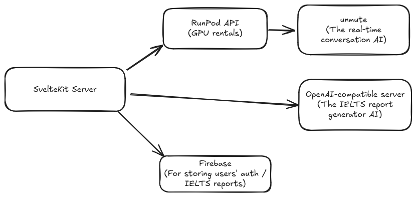

# IELTS AI Examiner

[](https://opensource.org/licenses/MIT)

An AI-powered web application designed to help users practice for the IELTS speaking test. Get instant, detailed feedback and track your progress over time.

**Live Demo:** **[ielts.waiyip.life](https://ielts.waiyip.life)**

---

## 🌟 Features

*   **🗣️ Real-time Conversational Practice:** Engage in a realistic, spoken conversation with an AI examiner.
*   **📊 Detailed Score Report:** Receive an estimated overall IELTS band score, broken down into the four official criteria: Fluency and Coherence, Lexical Resource, Grammatical Range and Accuracy, and Pronunciation.
*   **📈 Progress Tracking:** Visualize your score progression over time with an interactive chart.
*   **💡 Actionable Suggestions:** Get specific, sentence-level feedback on what you said and how you could improve it.
*   **🧠 Session Memory:** The AI remembers your previous performance and conversation topics for a personalized and continuous learning experience.
*   **💻 Pod Management:** Automatically starts / stops GPU instances so you only pay when there is an ongoing call.

## 🛠️ Tech Stack

*   **Gateway:** SvelteKit server running on a CPU instance 24/7
*   **Cloud & Deployment:** Firebase Authentication, CI/CD with GitHub Actions
*   **Backend:** A self-hosted, modified version of the [Unmute](https://github.com/kyutai-labs/unmute) project, running on a GPU instance from Runpod



## 🙏 Acknowledgements

This project's core speech-to-text and text-to-speech capabilities are powered by the incredible open-source project [Unmute](https://github.com/kyutai-labs/unmute) by Kyutai Labs. 

## 🚀 Getting Started

Follow these instructions to get a copy of the project up and running on your local machine for development and testing purposes.


### Installation & Setup

1.  **Clone the repository:**
    ```bash
    git clone https://github.com/knyl2013/ielts-examiner-gateway.git
    cd ielts-examiner-gateway
    ```

2.  **Create a local environment file:**
    Copy the example environment file. This file will hold your secret keys and configuration.
    ```bash
    cp .env.example .env
    ```

3.  **Configure your environment variables:**
    Open the newly created `.env` file and fill in your project credentials and any other required API endpoints.
    
    The only required env variables for running the project are: `OPENAI_API_KEY`, `OPENAI_BASE_URL` and `OPENAI_MODEL` for any OpenAI-compatible model (e.g. OpenAI, Gemini, Ollama) to analyze the conversation and estimate IELTS score after the conversation is finsihed.

4. **Launch unmute AI**
    Copy the environment file and docker-compose file to unmute project after filling the necessary variables
    ```bash
    cp .env unmute/.env
    ```

    Start up the project
    ```bash
    docker-compose --project-directory ./unmute -f ./docker-compose-unmute.yaml up -d
    ```

5.  **Run the start script:**
    This script will automatically install all necessary dependencies and launch the development server.
    ```bash
    bash start.sh
    ```

6. **Stop the service**
    ```bash
    docker-compose --project-directory ./unmute down
    ```

You should now be able to view the application at `http://localhost:3000`
